# Ingresse Android Test

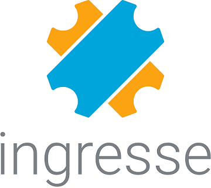

Projeto desenvolvido pensando em reutilização de código, separação de responsabilidade, organização e código limpo focando na arquitetura MVP.

## Principais Frameworks

- Butterknife
- Retrofit2
- Gson
- Picasso
- Room
- Lottie
- Testes com JUnit
- Lombok

# Entendendo o Projeto

Esse projeto utiliza o conceito MVP (Model View Presenter), temos a camada da **View** que se comunica com o **Presenter** no qual se comunica com o **Service** para obter os dados e assim retornando-os formatador para a **View**.

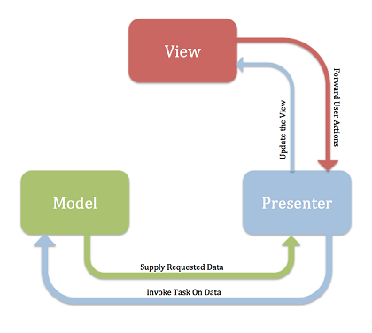

# APP

* Telas - **View** responsável pela interação da UI com o usuário através das **Activity**.

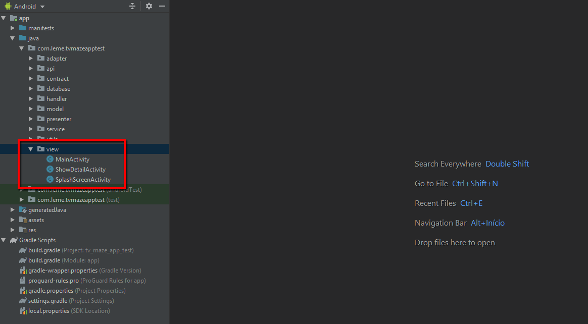

* Contract - **Interface** responsável por garantir o **contrato entre o Presenter, View e Model**.

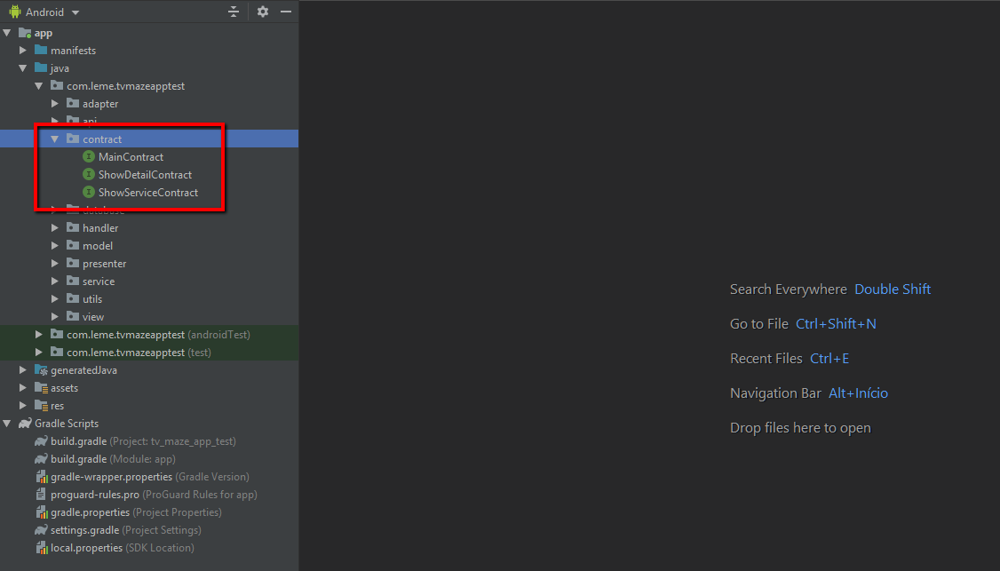

* Presenter - responsável por fazer a comunicação entre a **View** e o **Model**.

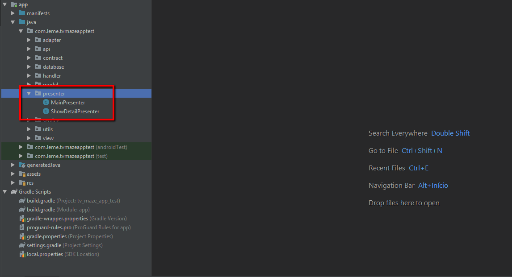

* Model - responsável por representar os dados de um objeto, carregados do service para as **View**, response/ApiResponse representa a classe desserializada a partir do json response da API, entity/Show representa a entidade utilizada para salvar os dados no banco e parcelable/ShowParcelable é a nossa classe DTO para transitar entre as activitys e fragments.

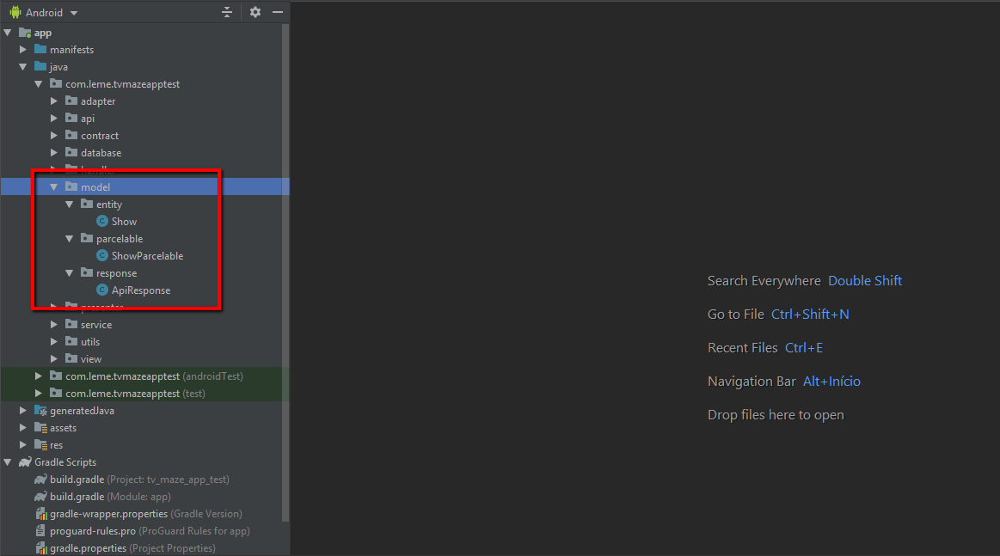

* API e Service - responsáveis garantir o contrato da API utilizada e obter os dados para o **Presenter**.

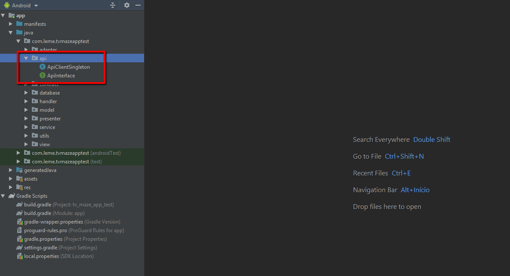

* Database - responsáveis por garantir a estrutura da tabela, controlar a instância utilizada do banco pelo app e contrato para definir os métodos que definem as querys necessarias.

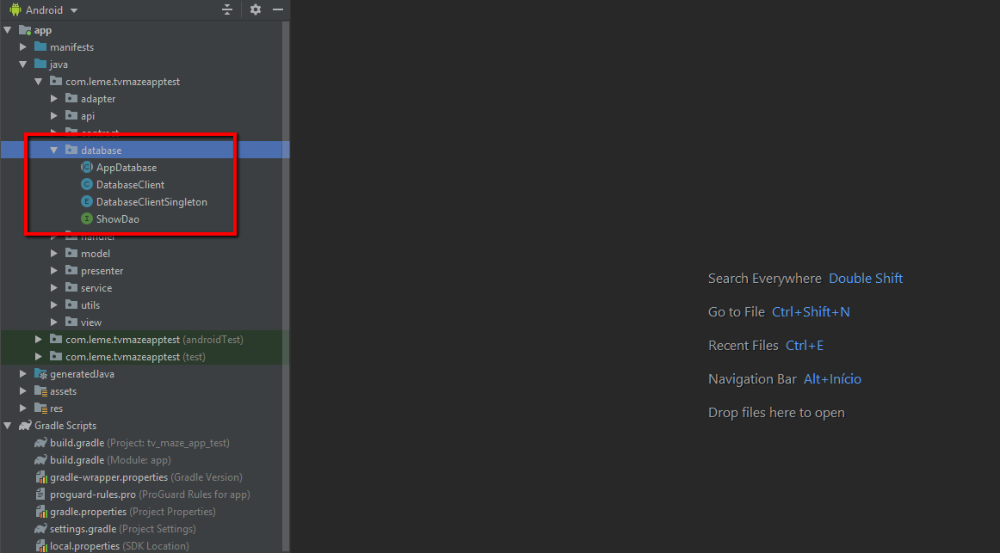

* Testes unitários - responsáveis por testar os métodos de desserialização, mapeamento de objetos e utilitários em geral.

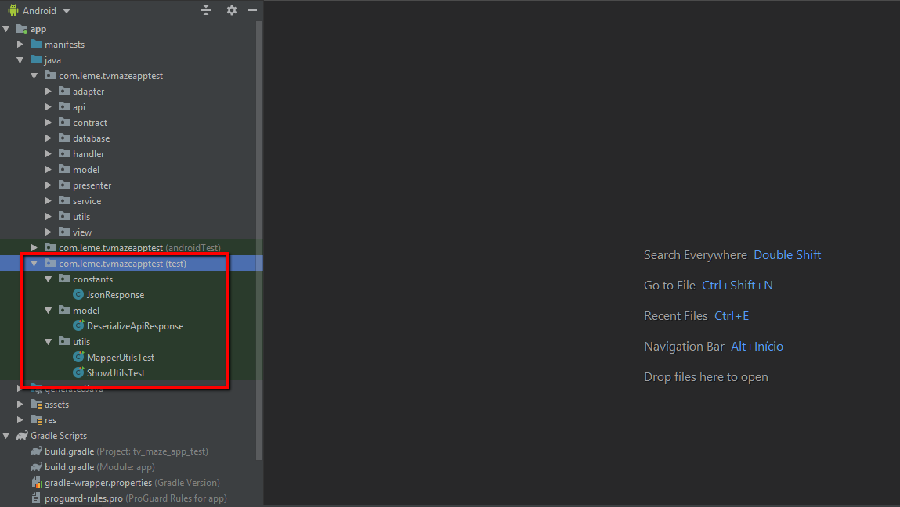

# RES

* Layouts, Dimens e Styles - xmls criados pensando em reusabilidade na criação dos layout para diferentes tamanhos de telas e orientações.

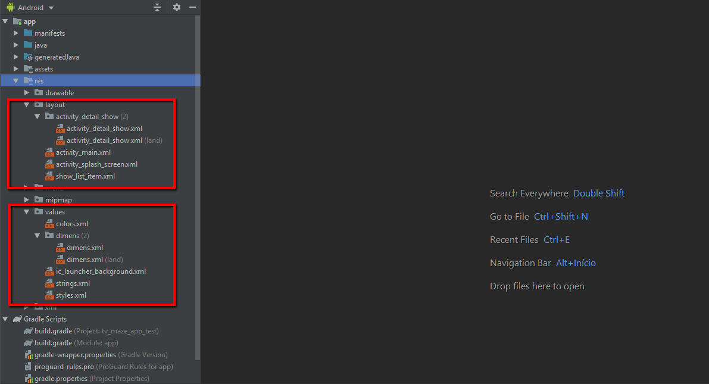

# Screens

* Prints das telas presentes no app em diferentes orientações.

### Portrait screenshots

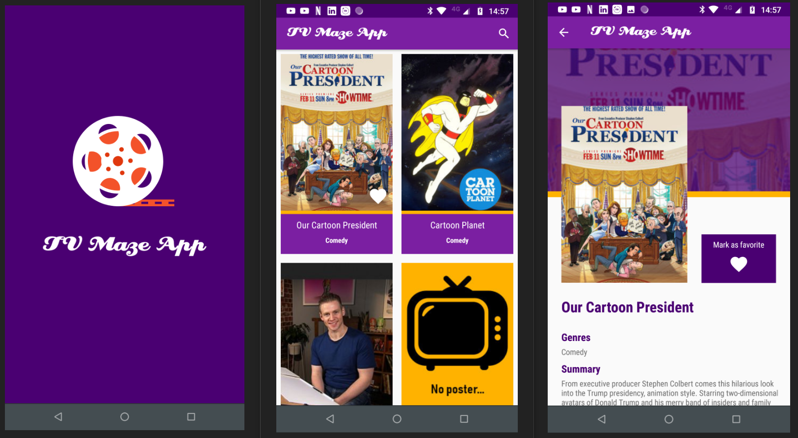

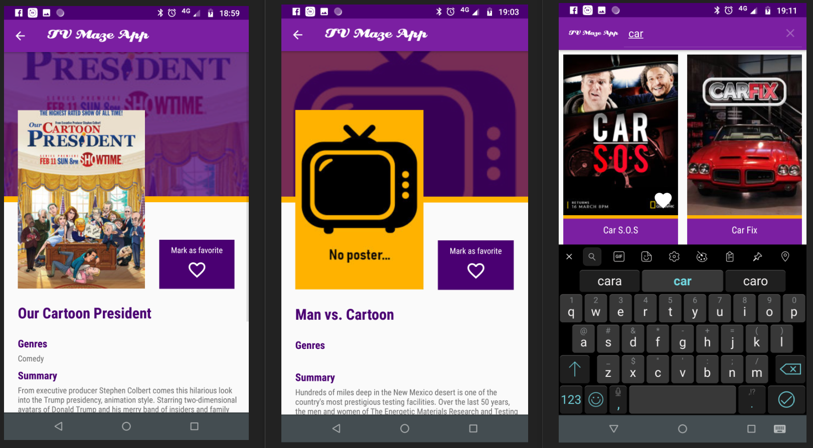

### Landscape screenshots

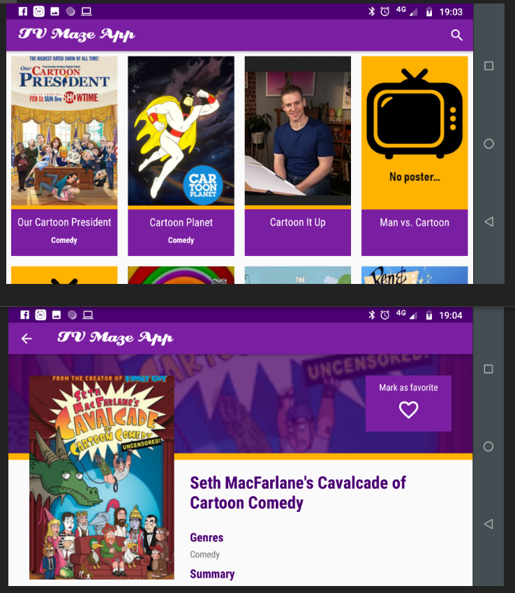

## Instalação do plugin do Projeto Lombok na IDE

No desenvolvimento do app foi utilizado o Projeto Lombok https://projectlombok.org/ para diminuir a verbosidade do código Java nas classes model. Para utilização no Android Studio é necessario a instalação de um plugin na IDE.

* File >> Settings

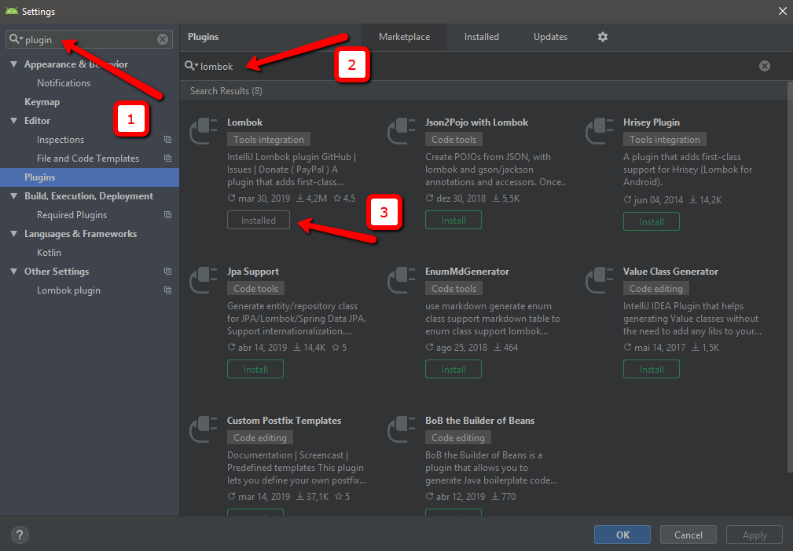

# Feature App TV Maze 2.0

Para a próxima feature está sendo implementado a alteração das principais Views (MainActivity e ShowDetailActivity) para utilização de Fragments para melhorar a experiência do usuário em smartphones e principalmente em tablets.

* O código fonte se encontra na branch: implement_fragment_layout

https://github.com/lemefe21/tv_maze_app_test/tree/implement_fragment_layout

# Tablet screens

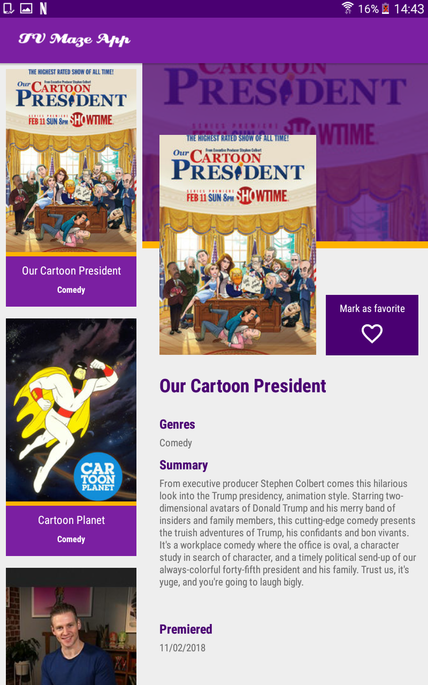

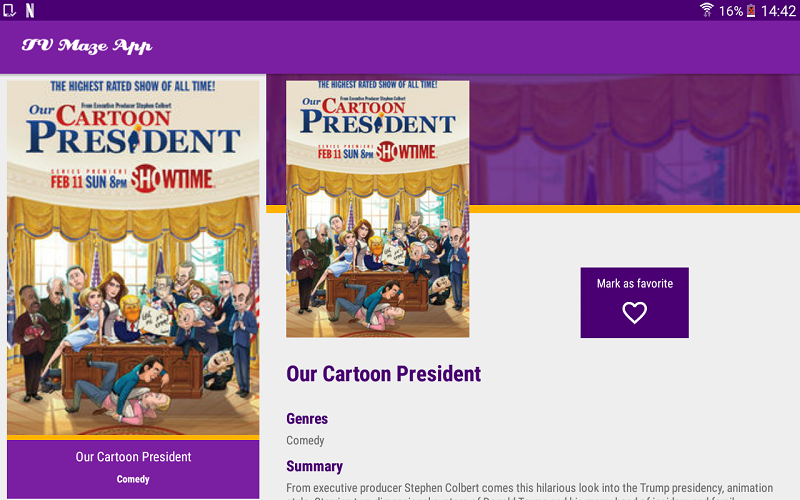